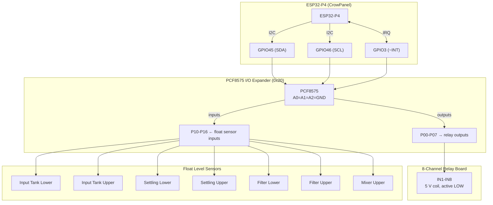

# Farm Waste Solid and Liquid Separator Machine — HMI Firmware

ESP32-P4 firmware for the Farm Waste Solid and Liquid Separator Machine. Provides a touchscreen HMI to control and monitor the separation process, with automatic and manual operation modes.

---

## Hardware

| Item | Detail |
|---|---|
| MCU | ESP32-P4 (RISC-V dual-core) |
| Display | CrowPanel 9″ 1024×600 RGB LCD |
| Touch | GT911 capacitive (I2C, GPIO40 RST / GPIO42 INT) |
| I/O Expander | PCF8575 16-bit I2C (addr `0x20`, GPIO45 SDA / GPIO46 SCL, 400 kHz) |
| Flash | 16 MB — single factory partition (no OTA) |
| Framework | ESP-IDF v5.4.3 |
| UI toolkit | LVGL 9.2.2 (SquareLine Studio 1.6.1 generated screens) |

---

## Wiring Diagram

### System Overview



---

### PCF8575 ↔ ESP32-P4 (I2C Bus)

| PCF8575 Pin | Connects to | Note |
|---|---|---|
| VCC | 3.3 V | |
| GND | GND | |
| SDA | GPIO45 | 4.7 kΩ pull-up to 3.3 V |
| SCL | GPIO46 | 4.7 kΩ pull-up to 3.3 V |
| ~INT | GPIO3 | 10 kΩ pull-up to 3.3 V; active-LOW, falling-edge ISR |
| A0 | GND | I2C address bit 0 |
| A1 | GND | I2C address bit 1 |
| A2 | GND | I2C address bit 2 → address `0x20` |

> The CrowPanel board supplies 3.3 V and GND on its expansion header. Pull-up resistors may already be present on the board; add 4.7 kΩ externally only if missing.

---

### PCF8575 P0x → 8-Channel Relay Board (Outputs, active LOW)

| PCF8575 | Relay Ch. | `#define` | Load | Relay Contact Type |
|---|---|---|---|---|
| P00 | IN1 | `RELAY_HEATER` | Drying heater | NO |
| P01 | IN2 | `RELAY_TOP_GATE` | Input tank top gate (solenoid) | NO |
| P02 | IN3 | `RELAY_BOTTOM_GATE` | Discharge bottom gate (solenoid) | NO |
| P03 | IN4 | `RELAY_FILTER_PUMP` | Filter tank pump | NO |
| P04 | IN5 | `RELAY_SETTLING_PUMP` | Settling tank pump | NO |
| P05 | IN6 | `RELAY_SUMP_PUMP` | Sump / inlet pump | NO |
| P06 | IN7 | `RELAY_SCREW_PRESS` | Screw press motor | NO |
| P07 | IN8 | `RELAY_MIXER` | Mixer motor | NO |

**Relay board power:**

| Relay Board Pin | Connects to |
|---|---|
| VCC | 5 V (external supply) |
| GND | Common GND |
| IN1–IN8 | PCF8575 P00–P07 |
| JD-VCC | 5 V (remove jumper for optocoupler isolation) |

> Each relay is energised when the corresponding PCF8575 output is driven **LOW** (logic 0). The PCF8575 initialises all outputs HIGH (all relays OFF) at startup.

**Relay NO contact wiring (per channel):**

```
  Load (+) ──── COM
  Load (−) ──── NO ──── Power supply (−)
  Power supply (+) ──── Load power (+)
```

> Use NO (normally-open) contacts so that a power loss or MCU reset leaves all loads de-energised.

---

### PCF8575 P1x ← Float Level Sensors (Inputs, active LOW)

Each float sensor is a **two-wire normally-open (NO) reed switch** type. When the float rises to the trigger level the contact closes, pulling the input pin to GND.

| PCF8575 | Sensor | Tank / Location | Pull-up |
|---|---|---|---|
| P10 | Input Tank Lower | Input tank — low-level refill | 10 kΩ to 3.3 V |
| P11 | Input Tank Upper | Input tank — high-level cutoff | 10 kΩ to 3.3 V |
| P12 | Settling Lower | Settling tank — low-level | 10 kΩ to 3.3 V |
| P13 | Settling Upper | Settling tank — high-level | 10 kΩ to 3.3 V |
| P14 | Filter Lower | Filter tank — low-level | 10 kΩ to 3.3 V |
| P15 | Filter Upper | Filter tank — high-level | 10 kΩ to 3.3 V |
| P16 | Mixer Upper | Mixer chamber — full | 10 kΩ to 3.3 V |

**Per-sensor wiring:**

```
  3.3 V ──┬── 10 kΩ ──┬── PCF8575 P1x
           │            │
           │         [Float SW]  (NO reed switch)
           │            │
          GND ──────────┘
```

> Idle (float down, switch open): pin reads **1** (pulled HIGH).  
> Triggered (float up, switch closed): pin reads **0** (pulled to GND).  
> The PCF8575 has weak internal pull-ups, but adding **10 kΩ external** pull-ups is recommended for noise immunity on cable runs to remote tanks.

---

## Relay Outputs (PCF8575 P0x — active LOW)

| Bit | Define | Load |
|---|---|---|
| P00 | `RELAY_HEATER` | Drying heater |
| P01 | `RELAY_TOP_GATE` | Input tank top gate |
| P02 | `RELAY_BOTTOM_GATE` | Discharge bottom gate |
| P03 | `RELAY_FILTER_PUMP` | Filter tank pump |
| P04 | `RELAY_SETTLING_PUMP` | Settling tank pump |
| P05 | `RELAY_SUMP_PUMP` | Sump / inlet pump |
| P06 | `RELAY_SCREW_PRESS` | Screw press motor |
| P07 | `RELAY_MIXER` | Mixer motor |

> Relay **ON** = bit `0`; Relay **OFF** = bit `1`. Initial state `0xFF` (all off).

---

## Sensor Inputs (PCF8575 P1x — active LOW)

| Bit | Define | Location |
|---|---|---|
| P10 | `SENSOR_INPUT_TANK_LOWER` | Input tank — lower float *(removed from hardware; unused, see note below)* |
| P11 | `SENSOR_INPUT_TANK_UPPER` | Input tank — upper float |
| P12 | `SENSOR_SETTLING_LOWER` | Settling tank — lower float |
| P13 | `SENSOR_SETTLING_UPPER` | Settling tank — upper float |
| P14 | `SENSOR_FILTER_LOWER` | Filter tank — lower float |
| P15 | `SENSOR_FILTER_UPPER` | Filter tank — upper float |
| P16 | `SENSOR_MIXER_UPPER` | Mixer tank — upper float |

> Sensor **triggered** = reads `0`; **idle** = reads `1`.

> **Input Tank Lower float removed:** residual sticky waste kept the float stuck, causing false "triggered" readings. Input tank refill during pressing is now driven by a **Refill Delay** timer instead (see Settings and Auto Process sections). The P10 input/UI indicator is left wired as a spare and is no longer used for control logic.

---

## Screens

### Splash Screen (`ui_scrSplashScreen`)
- Shown on boot. Displays project title and a loading bar.
- Loading bar animates 0 → 100 % over **3 seconds** (ease-in-out) then auto-navigates to Main Menu with a fade transition.

### Main Menu (`ui_scrMainMenu`)
- Navigation hub with buttons for **Run Auto**, **Test Machine**, and **Settings**.

### Run Auto (`ui_scrRunAuto`)
- Displays the process flow diagram image as background.
- 8 relay status indicators (read-only colored buttons): **green** = energised, **dark gray** = off.
- 7 sensor status indicators (checkboxes, no label text): **checked** = sensor triggered, **unchecked** = idle.
- `STATUS:` label shows the current process phase in plain text.
- **Emergency Stop** button: stops the auto process task, de-energises all relays immediately, and returns to Main Menu.
- **Navigating to this screen automatically starts the process** if it is currently idle.

### Test Machine (`ui_scrTestMachine`)
- 8 latching relay toggle buttons — tap to energise, tap again to de-energise.
- Button color reflects relay state: green = ON, dark gray = OFF.
- 7 read-only sensor checkboxes (no label): checked when the corresponding sensor is triggered.
- **Stop Test** button: de-energises all relays and returns to Main Menu.

### Settings (`ui_scrSettings`)
- Cycle through 4 settings with **Previous** / **Next** buttons.
- Adjust value with **+** / **−** buttons.
- Select step size with multiplier buttons: **×0.1**, **×1**, **×5** (active button highlighted green).
- **Save** button: writes values to NVS and returns to Main Menu.
- Values are loaded from NVS on every screen visit; defaults are used on first boot.

| Setting | NVS Key | Default | Unit |
|---|---|---|---|
| Mixer Interval | `mix_int` | 10.0 | minutes |
| Mixer Run Time | `mix_rt` | 1.0 | minutes |
| Drying Time | `dry_t` | 120.0 | minutes |
| Discharge Time | `dis_t` | 1.0 | minutes |
| Refill Delay | `refill_d` | 5.0 | minutes |

---

## Auto Process — Run Auto (`app_process.c`)

### Overview

The auto process runs as a FreeRTOS task (`proc_task`, priority 5, 8 kB stack) that ticks every **100 ms**. It is started by `app_process_init()` and idles until triggered. Navigating to the **Run Auto** screen fires an `LV_EVENT_SCREEN_LOADED` callback which sets a start flag; on the next task tick the state machine leaves `PROC_IDLE` and the cycle begins.

All relay writes and UI indicator updates are performed atomically — hardware is written directly via `pcf8575_set_relay()` and the LVGL lock (`lvgl_port_lock`) is acquired only for the indicator colour and status label update, then immediately released.

---

### Process Overview

```
   Sump → [Input Tank] → Screw Press → [Mixer Chamber] → discharge dry solids
                                  ↓
                          [Settling Tank] → [Filter Tank] → treated water out
```

The system has two parallel paths:
- **Solid path**: filling → pressing → drying → discharging
- **Waste water path**: settling tank → filter tank, each independently level-controlled

---

### State Diagram

```
           Screen loaded (IDLE)
                   │
                   ▼
┌──────────────────────────────────────────────────────────┐
│  PROC_IDLE  — all relays OFF, status "IDLE"              │
└──────────────────────────────────────────────────────────┘
                   │  s_start_request set
                   ▼
┌──────────────────────────────────────────────────────────┐
│  PROC_FILLING                                            │
│  ON:  SUMP_PUMP                                          │
│  STATUS: "FILLING INPUT TANK"                            │
│  WAIT: SENSOR_INPUT_TANK_UPPER triggered                 │
└──────────────────────────────────────────────────────────┘
                   │  input tank upper float triggered
                   ▼
┌──────────────────────────────────────────────────────────┐
│  PROC_PRESSING                                           │
│  ON:  SCREW_PRESS, TOP_GATE (mixer upper gate)           │
│  SUMP_PUMP: level-controlled by input tank floats        │
│  STATUS: "SCREW PRESSING"                                │
│  WAIT: SENSOR_MIXER_UPPER triggered (mixer full)         │
└──────────────────────────────────────────────────────────┘
                   │  mixer upper float triggered
                   ▼
┌──────────────────────────────────────────────────────────┐
│  PROC_DRYING                                             │
│  OFF: SCREW_PRESS, TOP_GATE, SUMP_PUMP                   │
│  ON:  HEATER  (+ periodic MIXER cycle)                   │
│  STATUS: "DRYING"                                        │
│  WAIT: Drying Time setting elapsed                       │
└──────────────────────────────────────────────────────────┘
                   │  timer expired
                   ▼
┌──────────────────────────────────────────────────────────┐
│  PROC_DISCHARGING                                        │
│  OFF: HEATER                                             │
│  ON:  BOTTOM_GATE, MIXER (sweeps solids out)             │
│  STATUS: "DISCHARGING"                                   │
│  WAIT: Discharge Time setting elapsed                    │
└──────────────────────────────────────────────────────────┘
                   │  Discharge Time elapsed
                   └─────────────► back to PROC_IDLE
```

---

### State Details

#### PROC_IDLE
- All 8 relays off.
- Status label: `IDLE`.
- Task loops at 100 ms but takes no action until `s_start_request` is set.
- `s_start_request` is set by the `LV_EVENT_SCREEN_LOADED` callback on the Run Auto screen — so **arriving at the Run Auto screen is the trigger**.

#### PROC_FILLING
The **Sump Pump** turns on to pump raw waste sludge into the input tank. No other relays are active.

| Relay | State |
|---|---|
| `RELAY_SUMP_PUMP` | ON |

Exits when `SENSOR_INPUT_TANK_UPPER` is triggered (input tank is full).

#### PROC_PRESSING
The input tank is full. The **Mixer Upper Gate** (TOP_GATE) opens to receive solids from the screw press, then the **Screw Press** starts compressing the sludge. Liquid squeezed out flows to the settling tank. While pressing runs the input tank level is maintained by a timer-based refill cycle (the lower float sensor was removed — see below): the sump pump stays off for the **Refill Delay** after the tank was last filled, then turns back on until `SENSOR_INPUT_TANK_UPPER` triggers again.

| Relay | State |
|---|---|
| `RELAY_SUMP_PUMP` | timer-controlled (off for Refill Delay, then on until upper float trips) |
| `RELAY_TOP_GATE` | ON (mixer upper gate open) |
| `RELAY_SCREW_PRESS` | ON |

Exits when `SENSOR_MIXER_UPPER` is triggered (mixer chamber is full of compressed solids).

#### PROC_DRYING
Screw press stops. The **Mixer Upper Gate** closes (sealing the mixer chamber). Sump pump stops. The **Heater** turns on to dry the solid cake. The mixer motor runs on a periodic cycle to distribute heat evenly and prevent the cake from hardening unevenly.

| Relay | State |
|---|---|
| `RELAY_SCREW_PRESS` | OFF |
| `RELAY_TOP_GATE` | OFF (mixer upper gate closed) |
| `RELAY_SUMP_PUMP` | OFF |
| `RELAY_HEATER` | ON |
| `RELAY_MIXER` | periodic cycle |

Exits when the **Drying Time** setting (default 120 min, configurable) has elapsed since entering this state.

#### PROC_DISCHARGING
Heater stops. The **Bottom Gate** opens and the **Mixer** runs continuously to sweep all dried solid material out of the mixer chamber.

| Relay | State |
|---|---|
| `RELAY_HEATER` | OFF |
| `RELAY_BOTTOM_GATE` | ON |
| `RELAY_MIXER` | ON (continuous, sweeps solids out) |

Runs for the **Discharge Time** setting duration (default 1.0 min, configurable), then all relays off and returns to `PROC_IDLE`. A new cycle starts automatically the next time the Run Auto screen is navigated to.

---

### Input Tank Level Control (active during PRESSING)

The input tank's lower float sensor was removed — residual sticky waste kept fouling it and causing false triggers. The sump pump is now controlled by a timer-based refill cycle (`tick_input_tank`) called every 100 ms:

```
SENSOR_INPUT_TANK_UPPER triggered  →  stop SUMP_PUMP, start Refill Delay timer
Refill Delay timer elapsed         →  start SUMP_PUMP again
```

- **Refill Delay** (default 5 min, configurable) — how long the pump stays off after the tank was last filled, before refilling starts again.
- The pump then runs until `SENSOR_INPUT_TANK_UPPER` triggers again, restarting the cycle.

This ensures a steady, non-continuous supply of raw sludge to the screw press throughout the pressing phase without relying on the fouled lower float sensor.

---

### Mixer Cycle (active during PRESSING and DRYING)

The mixer does not run continuously during pressing and drying — it pulses on a repeating interval:

```
|<------ Mixer Interval ------>|<- Run Time ->|<------ Mixer Interval ------>| ...
         MIXER OFF                  MIXER ON           MIXER OFF
```

- **Mixer Interval** (default 10 min) — idle time between mixer runs.
- **Mixer Run Time** (default 1 min) — how long the mixer stays on each pulse.

The phase clock resets at the start of each PRESSING and DRYING state so the first pulse always fires `Mixer Interval` minutes after entering that state.

> During DISCHARGING the mixer runs **continuously** (not on a cycle) to sweep out all dry solids.

---

### Waste Water Treatment Path (parallel, all non-idle states)

The liquid squeezed from the screw press drains into the settling tank. Both tanks are independently level-controlled each 100 ms tick:

```
Screw Press liquid output
        │
        ▼
  [Settling Tank]
  upper float → start SETTLING_PUMP → pumps to filter tank
  lower float → stop  SETTLING_PUMP
        │
        ▼
  [Filter Tank]
  upper float → start FILTER_PUMP → pumps treated water out
  lower float → stop  FILTER_PUMP
```

Each pump is controlled only by its own tank's sensors — the settling pump does not affect the filter pump and vice versa.

---

### Emergency Stop

Calling `app_process_stop()` (Emergency Stop button on the Run Auto screen):

1. Forces `s_state = PROC_IDLE` and clears `s_start_request`.
2. Calls `pcf8575_set_all_relays(0x00)` — all 8 relay coils de-energised in one I2C write.
3. Acquires the LVGL lock and updates all 8 indicator colours to gray and sets the status label to `IDLE`.

The process will not restart until the Run Auto screen is navigated to again.

---

## Sensor Updates (Interrupt-Driven)

The PCF8575 `~INT` pin (GPIO3) is configured with a **falling-edge ISR**. The ISR gives a FreeRTOS binary semaphore without doing any I2C work. A dedicated `sensor_int_task` (priority 3, 3 kB stack) blocks on that semaphore and wakes immediately when any sensor input changes:

```
Float switch changes state
        │
        ▼  falling edge on GPIO3
   pcf8575_isr_handler()  [IRAM, ISR context]
        │  xSemaphoreGiveFromISR
        ▼
   sensor_int_task  [FreeRTOS task]
        │  pcf8575_update_sensor_cache()  — one I2C read, no lock needed
        │  lvgl_port_lock()
        │  sensor_update_ui()            — update checkbox widgets on both screens
        │  lvgl_port_unlock()
        └─ block on semaphore again
```

If the interrupt edge is ever missed the task has a **2-second watchdog timeout** on `xSemaphoreTake`, ensuring the UI is re-synced at least every 2 s regardless.

State transitions are logged via `ESP_LOGI` (tag `APP_MACHINE`) only when a sensor changes, avoiding log spam:

```
I (12345) APP_MACHINE: >>> SENSOR INPUT_TANK_UPPER        | bit  9 | -> TRIGGERED
I (15200) APP_MACHINE: >>> SENSOR INPUT_TANK_UPPER        | bit  9 | -> CLEARED
```

---

## Project Structure

```
main/
  main.c                  Boot sequence, hardware init, splash animation
  app_machine.c/h         Test Machine button callbacks, Run Auto indicators,
                          interrupt-driven sensor task, relay logging
  app_settings.c/h        Settings screen NVS persistence and UI callbacks
  app_process.c/h         Auto process FreeRTOS state machine
  include/
    main.h
  ui/                     SquareLine Studio generated UI files
    ui.c / ui.h
    screens/
      ui_scrSplashScreen.c/h
      ui_scrMainMenu.c/h
      ui_scrRunAuto.c/h
      ui_scrSettings.c/h
      ui_scrTestMachine.c/h

peripheral/
  bsp_display/            EK79007 LCD + LVGL port init
  bsp_i2c/                I2C bus init (GPIO45/46, port 0, 400 kHz)
  bsp_extra/              GPIO extras (LED on GPIO48)
  bsp_illuminate/         LCD backlight PWM
  bsp_pcf8575/            PCF8575 I2C I/O expander driver (relay control,
                          sensor reads, ~INT GPIO ISR)

managed_components/
  lvgl__lvgl              LVGL 9.2.2
  espressif__esp_lvgl_port
  espressif__esp_lcd_ek79007
  espressif__esp_lcd_touch
  espressif__esp_lcd_touch_gt911
  espressif__cmake_utilities
```

---

## Partition Table

```
# Name,   Type, SubType, Offset,   Size
nvs,      data, nvs,     0x9000,   0x6000
phy_init, data, phy,     0xF000,   0x1000
factory,  app,  factory, 0x10000,  0xDF0000   # 14.27 MB
```

Binary size ~12.9 MB — ~12 % headroom.

---

## Build

Requirements: ESP-IDF v5.4.3, target `esp32p4`.

```bash
idf.py set-target esp32p4
idf.py build
idf.py flash monitor
```
